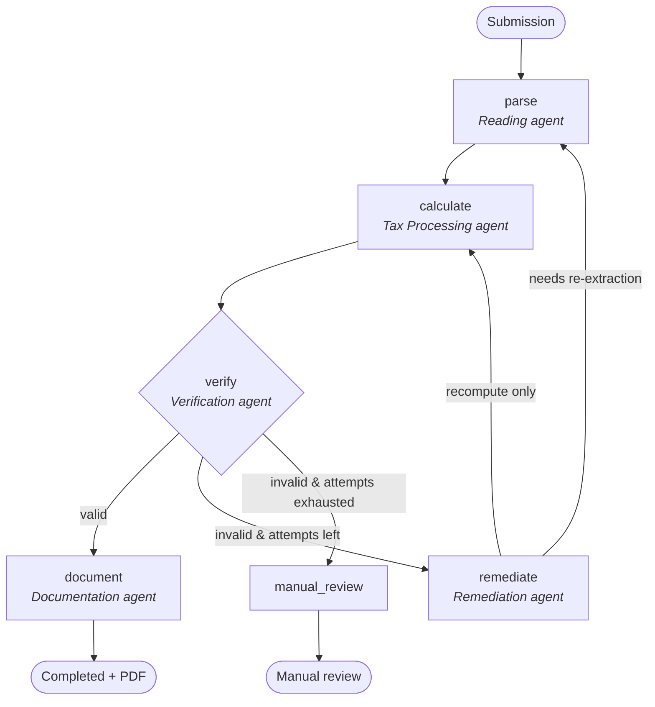

# Self-Healing Multi-Agent Tax Filing System

A **local-first** system that turns a pile of US tax documents into a verified,
line-numbered Form 1040 — without ever letting a language model do the tax
arithmetic. Five cooperating agents extract every figure from the source
documents (grounding each one to evidence), compute the return on a
**deterministic** 2025 federal tax engine, challenge the result with two
independent verdicts (correctness *and* completeness), run a **bounded
self-healing loop** when a check fails, and emit an official-style 1040 PDF with
the supporting schedules the return actually used.

The design principle throughout: **LLMs read and classify; deterministic code
decides and computes.** Tax math is never authored by a model, and every
monetary value on the return must be traceable to a source document.

---

## Architecture

The pipeline is a [LangGraph](https://github.com/langchain-ai/langgraph) state
machine (`backend/app/workflow/graph.py`). Verification gates the flow: a passing
return is documented, a failing one is remediated (a bounded number of times)
and re-run, and anything still failing escapes to manual review.



| Agent | Node | Responsibility |
| --- | --- | --- |
| **Reading** | `parse` | OCR + vision/cloud extraction of W-2s and info returns; merges multiple documents; grounds each field to `SourceEvidence`. |
| **Tax Processing** | `calculate` | Deterministic Form 1040 computation on versioned, source-cited parameters. |
| **Verification** | `verify` | Recomputes from raw inputs, checks W-2 statutory invariants, requires evidence for every figure, reconciles completeness against a transcript, scores confidence. |
| **Remediation** | `remediate` | Classifies the failure and applies *bounded* deterministic fixes, or requests a higher-resolution re-extraction. Never invents values. |
| **Documentation** | `document` | Renders the line-numbered 1040 + conditional schedules to PDF and produces a filing receipt. |

Runs are checkpointed per `submission_id` (LangGraph `MemorySaver`), so a graph
execution is resumable and inspectable. The workflow status moves through
`parsing → calculating → verifying → (remediating) → completed | manual_review`
(or `failed` on an unhandled error).

---

## Key design decisions (the "why")

- **Deterministic tax engine, never an LLM.** All arithmetic lives in
  `backend/app/agents/tax_processing/` and `backend/app/tax_rules/`. Models are
  used only to read documents and to *classify* failures — they cannot author a
  number that lands on the return. This is what makes the output auditable and
  reproducible.
- **Source-grounded extraction.** Every monetary field carries `SourceEvidence`
  (page, raw text, extractor, confidence). The verification agent *rejects* any
  figure without evidence, which is the system's primary defense against
  hallucinated income or withholding.
- **Two-verdict verification.** *Correctness* re-derives the return from the raw
  inputs and checks W-2 statutory invariants (e.g. box 4 ≈ 6.2% of box 3, box 6 ≈
  1.45% of box 5). *Completeness* reconciles the extracted income against an IRS
  Wage & Income transcript so missing documents are caught, not just wrong ones.
- **Bounded self-healing.** Failures route to remediation, which applies
  deterministic fixes or a re-extraction pass — but the loop is capped
  (`MAX_REMEDIATION_ATTEMPTS`) and deterministically escapes to `manual_review`
  rather than looping or guessing.
- **Versioned, source-cited tax parameters.** Each tax year is a registered
  parameter set (`backend/app/tax_rules/`) carrying a `verified` provenance flag;
  `validation.py` enforces structural invariants on every registered year so a
  transcription error is caught at import time.
- **Swappable boundaries.** Extraction sits behind a `W2Extractor` protocol
  (offline parser ↔ Azure Document Intelligence) and filing sits behind an
  `EFileBackend` protocol (self-file PDF ↔ simulated MeF transmitter). Both swap
  via a single environment variable.

---

## What's implemented vs. intentionally out of scope

**Implemented**

- US **federal** tax year **2025** (reconciled against Rev. Proc. 2024-40,
  `verified=True`). Tax year **2018** is also registered to exercise the
  multi-year parameter registry, and stays `verified=False`.
- Form 1040 flow: AGI with above-the-line adjustments; standard deduction
  (incl. 65+/blind and the OBBBA senior deduction) vs. itemized (Schedule A with
  SALT cap, medical floor, charitable limit); **IRS Tax Tables** under $100k and
  the **Tax Computation Worksheet** at/above; preferential **qualified
  dividends / long-term capital gains** rates; **QBI** (Form 8995, simplified).
- Credits: **Child Tax Credit / ODC** with phase-out and refundable ACTC;
  refundable **EITC**; **education credits** (AOTC/LLC); **Saver's Credit**.
- **State income tax** for all 42 taxing states **plus DC**, via a per-state
  rule-pack registry. **CA, NY, NJ, AZ** are high-accuracy (`verified=True`,
  delegating to the `tenforty`/OpenTaxSolver engine, parameter-verified against
  official 2025 schedules); the rest are cited reference packs. See the
  [State income tax](#state-income-tax) section.
- Other federal taxes: **self-employment tax**, **Additional Medicare Tax**,
  **NIIT**, **AMT** (Form 6251, simplified), and the **excess Social Security**
  withholding credit.
- Also: Social Security benefit taxability (Pub 915), taxable pension/IRA and
  K-1 income, capital-loss carryover, and the Qualifying Surviving Spouse status.
- Extraction beyond the W-2: 1099-INT/DIV/R/NEC/MISC/G, SSA-1099, 1099-B
  (summary totals), Schedule K-1 (per-box), and 1098/1098-T.

**Out of scope (by design)**

- **State income tax** is now modelled for every taxing state plus DC — see the
  dedicated [State income tax](#state-income-tax) section below. Still out of
  scope: **multi-state / part-year** allocation (the engine assigns all income to
  one resident state) and **local** income taxes (NYC/Yonkers, MD counties, OH/PA
  municipalities).
- **Real IRS e-file.** There is no open public e-file API — transmission requires
  the MeF system behind an EFIN/ERO that has passed ATS testing. Filing therefore
  sits behind a swappable adapter: the default `pdf` backend produces a self-file
  package, and `mock_transmitter` simulates a commercial MeF transmitter to
  demonstrate the swap.

---

## State income tax

State income tax is **opt-in** and computed by a per-state *rule-pack* registry
(`backend/app/state_rules/`), the state-level peer of the federal parameter
registry. The taxpayer's state is looked up as `(state, year)`; if no pack is
installed the engine falls back to the flat `state_tax_rate` (default `0.0`).
The eight states with **no income tax** (AK, FL, NV, SD, TN, TX, WY, WA) simply
have no pack and yield `$0`.

Full per-state status, sources, and caveats live in
[`docs/state-rules-coverage.md`](docs/state-rules-coverage.md).

### Two tiers of accuracy

| Tier | States | How it's computed |
| --- | --- | --- |
| **High-accuracy** (`verified=True`) | **CA, NY, NJ, AZ** | Delegated to the [`tenforty`](https://github.com/mmacpherson/tenforty) library (OpenTaxSolver engine), which models each state's own income base, deductions, exemptions, and credits. Parameter-verified against official 2025 state schedules and pinned by golden-case tests. |
| **Reference** (`verified=False`) | the other 38 taxing states + DC | Hand-encoded brackets transcribed from cited statutes / DOR tables. Good for ballpark estimates; **not** reconciled against published returns, so not for filing. |

Every constant follows the same provenance contract as the federal rules: it
cites a `source` and stays `verified=False` until reconciled. Constants are never
invented by the LLM.

### How state selection works end-to-end

The taxpayer's state is **derived from the W-2** (box 15), not hand-set:

1. The Azure W-2 extractor and the OCR parser capture the state code; the
   primary state is the one with the most state tax withheld.
2. `TaxpayerData.aggregate_w2s()` folds that into `data.state`.
3. Free-text input is normalised (`"california"`, `"ca "`, `"D.C."` → `CA`/`DC`)
   via `normalize_state`; unrecognised values pass through harmlessly (no pack
   match → safe `$0` fallback).

### High-accuracy modelling details (CA / NY / NJ / AZ)

- **Social Security** is excluded for all four (correct — none tax it); the
  federally-taxable SS amount is only injected for states flagged as taxing it.
- **Pension / retirement income** is handled per state:
  - **NY** — the $20,000 pension/annuity exclusion (Tax Law 612(c)(3-a)), gated
    at age 59½.
  - **NJ** — OTS ignores NJ capital gains and mis-handles its Schedule-1 line,
    so NJ-taxable income is routed into the fields OTS taxes, and NJ's
    income-limited retirement exclusion (54A:6-10, age 62+, phased across
    $100k/$125k/$150k) **plus** the Other Retirement Income Exclusion
    (54A:6-15, earned income ≤ $3,000) are computed in the adapter.
- **Exact ages** come from optional `birth_date` / `spouse_birth_date` (age at
  tax year-end), falling back to integer `age` then the 65+ booleans.
- **Robustness** — if the engine errors or the dependency is missing, the pack
  transparently falls back to its reference pack; the pipeline never fails.

### Verification

- **Parameter-level (done)** — CA/NY/NJ/AZ reconciled against official 2025
  sources (FTB rate schedules + standard deduction + exemption credit; NY
  IT-201 standard deduction and the >$107,650 tax-benefit recapture; NJ personal
  exemption; AZ 2.5% flat + federal-conformed deduction). tenforty was
  cross-checked against NBER TAXSIM, which confirmed the methodology
  directionally; note TAXSIM's federal stops at 2023 and its recent-year state
  law is an estimate, so it is not itself a 2025 oracle.
- **End-to-end (pending)** — matching full returns against commercial tax
  software is the remaining step for NY/NJ/AZ (CA is validated by tenforty
  against professional software).

### Adding a state

- **Reference pack** — drop a `states/<state>_<year>.py` module that registers a
  `FlatStatePack`, `BracketStatePack`, or a custom `StateRulePack`, then add it
  to `states/__init__.py`.
- **High-accuracy** — add a one-line `TenfortyStatePack(...)` registration in
  `states/_tenforty_overrides.py` (tenforty's engine covers ~43 states).

---

## Tech stack

| Layer | Technology |
| --- | --- |
| API | FastAPI + Uvicorn, Pydantic v2 |
| Orchestration | LangGraph (stateful agent graph with checkpointer) |
| Local models | Ollama — vision (`llama3.2-vision`) for the extraction pass, coder (`qwen2.5-coder:7b`) for failure classification |
| Document extraction | PyMuPDF + Tesseract (OCR), label-anchored W-2 parser; optional **Azure Document Intelligence** (`prebuilt-tax.us.w2`) |
| Tax engine | Pure-Python deterministic 1040 engine with versioned parameters |
| Persistence | SQLAlchemy 2.x — **SQLite** by default, **PostgreSQL** via Docker |
| Vector store | ChromaDB (embedded, or standalone via Docker) |
| Reporting | ReportLab (line-numbered Form 1040 + conditional schedules) |
| Frontend | React 18 + TypeScript + Vite |

> Local-first: there is no hosted/proprietary LLM API dependency. Azure Document
> Intelligence is the one *optional* cloud component (off by default). If the
> Ollama models aren't pulled, the pipeline degrades gracefully — the vision pass
> returns nothing and remediation falls back to deterministic classification; the
> deterministic engine and the configured extractor still carry the core flow.

---

## Quickstart

### Prerequisites

- **Python 3.11+** and **Node 18+**
- **[Ollama](https://ollama.com)** running locally, with the configured models:

  ```bash
  ollama pull llama3.2-vision:latest
  ollama pull qwen2.5-coder:7b
  ```

  (These are the defaults in `config.py`; you can repoint `OLLAMA_*` at any models
  you have. The app boots and processes returns even if they're absent.)

### 1. Backend

```bash
cd backend
python -m venv .venv && source .venv/bin/activate   # Windows: .venv\Scripts\Activate.ps1
pip install -r requirements.txt
cp .env.example .env                                 # Windows: copy .env.example .env
python -m uvicorn app.main:app --reload --port 8000
```

- API: <http://localhost:8000>
- Interactive docs: <http://localhost:8000/docs>
- Health: <http://localhost:8000/api/v1/health>

The default database is **SQLite** (`tax_filing.db`) — no Docker required.

### 2. Frontend

```bash
cd frontend
npm install
npm run dev
```

Open <http://localhost:5173>. The Vite dev server proxies `/api → :8000`, so the
UI talks to the backend out of the box. Upload a W-2 (plus any 1099s/K-1/1098)
and the UI polls the submission to completion automatically.

### 3. Try it with no documents

The deterministic engine and verification run end-to-end on synthetic data:

```bash
cd backend
python -m app.synthetic.demo
```

### Optional: PostgreSQL + standalone ChromaDB

```bash
docker compose up -d
# then set DATABASE_URL in backend/.env to the postgresql+psycopg URL
```

### Optional: Azure Document Intelligence (cloud W-2 extraction)

The W-2 extractor defaults to the offline `label` parser, which needs no cloud
account. To swap in Azure's `prebuilt-tax.us.w2` model instead, you need an
**endpoint** and an **API key** from an Azure Document Intelligence (formerly
"Form Recognizer") resource. To get them:

1. Sign in to the [Azure Portal](https://portal.azure.com) (create a free
   account if you don't have one — Document Intelligence has a free `F0` tier).
2. Click **Create a resource**, search for **Document Intelligence** (it may
   still be listed as **Form Recognizer**), and select **Create**.
3. Fill in the resource form:
   - **Subscription** and **Resource group** (create one if needed).
   - **Region** — pick one near you.
   - **Name** — a unique name for the resource.
   - **Pricing tier** — `Free F0` to start, or `Standard S0` for production.
4. Select **Review + create**, then **Create**, and wait for the deployment to
   finish.
5. Open the resource and go to **Keys and Endpoint** in the left sidebar. Copy:
   - the **Endpoint** (e.g. `https://<your-resource>.cognitiveservices.azure.com/`)
     → `AZURE_DI_ENDPOINT`
   - **KEY 1** (or KEY 2) → `AZURE_DI_KEY`
6. Put them in `backend/.env` and turn the extractor on:

   ```bash
   W2_EXTRACTOR=azure
   AZURE_DI_ENDPOINT=https://<your-resource>.cognitiveservices.azure.com/
   AZURE_DI_KEY=<your-key>
   ```

Restart the backend to pick up the change. Either key works and they can be
rotated independently in the portal; keep them out of version control.

---

## Configuration

All settings load from `backend/.env` (see `.env.example`) and
`backend/app/core/config.py`.

| Variable | Default | Effect |
| --- | --- | --- |
| `DATABASE_URL` | `sqlite:///./tax_filing.db` | SQLAlchemy connection string. Use `postgresql+psycopg://…` for Postgres. |
| `OLLAMA_BASE_URL` | `http://localhost:11434` | Ollama server URL. |
| `OLLAMA_VISION_MODEL` | `llama3.2-vision:latest` | Model for the document vision-extraction pass. |
| `OLLAMA_CODER_MODEL` | `qwen2.5-coder:7b` | Model used to classify verification failures. |
| `CHROMA_PATH` | `../storage/chroma` | Embedded ChromaDB path. |
| `STORAGE_ROOT` | `../storage` | Root for uploads, generated PDFs, previews. |
| `VERIFICATION_THRESHOLD` | `0.95` | Confidence below which a return is not auto-documented. |
| `MAX_REMEDIATION_ATTEMPTS` | `2` | Cap on the self-healing loop before `manual_review`. |
| `DEFAULT_STATE_TAX_RATE` | `0.0` | Opt-in flat state rate; `0` disables state tax. |
| `EFILE_BACKEND` | `pdf` | `pdf` (self-file package) or `mock_transmitter` (simulated MeF). |
| `W2_EXTRACTOR` | `label` | `label` (offline parser) or `azure` (Document Intelligence). |
| `AZURE_DI_ENDPOINT` / `AZURE_DI_KEY` | _(empty)_ | Credentials when `W2_EXTRACTOR=azure`. |
| `TESSERACT_CMD` | _(empty)_ | Override path to the Tesseract binary if not on `PATH`. |
| `ALLOWED_ORIGINS` | `http://localhost:5173` | Comma-separated CORS allow-list. |
| `API_KEY` | _(empty)_ | When set, all submission endpoints require `X-API-Key`. Empty disables auth (local dev only). |
| `LOG_LEVEL` | `INFO` | Structured logging level. |

---

## API

Submissions are **non-blocking**: `POST` returns `202` immediately and the agent
pipeline runs in the background; clients poll `GET` until the status is terminal
(`completed`, `manual_review`, or `failed`). All endpoints are under
`/api/v1`. When `API_KEY` is set, send it as the `X-API-Key` header.

| Method | Path | Description |
| --- | --- | --- |
| `GET` | `/api/v1/health` | Liveness + whether Ollama is reachable. |
| `POST` | `/api/v1/submissions` | Upload one or more documents (PDF/PNG/JPG/JPEG). Returns `202` + `submission_id`. |
| `GET` | `/api/v1/submissions/{id}` | Current state: status, extracted data, calculation, verification, audit trail. |
| `GET` | `/api/v1/submissions/{id}/report` | Download the generated Form 1040 PDF (once `completed`). |

```bash
# Submit (multiple documents are merged into one return)
curl -F documents=@W2.pdf -F documents=@1099-INT.pdf \
     http://localhost:8000/api/v1/submissions
# -> 202 {"submission_id": "…", "status": "processing"}

# Poll
curl http://localhost:8000/api/v1/submissions/<id>

# Download the PDF once completed
curl -OJ http://localhost:8000/api/v1/submissions/<id>/report
```

**Security:** SSNs are masked before persistence and never written to the audit
log in clear; the submission endpoints are gated by `X-API-Key` when `API_KEY`
is configured.

---

## Testing

```bash
cd backend
pytest                       # full suite
pytest tests/unit            # tax engine, verification, extraction, security
pytest tests/integration     # full workflow, Form 1040 / PDF rendering
pytest tests/eval            # extraction quality
```

- **Unit** — deterministic tax calculator, verification checks, W-2 / 1099 /
  info-return parsing, parameter-registry invariants, SSN masking & auth.
- **Integration** — the end-to-end LangGraph workflow and the line-numbered
  Form 1040 / professional report rendering.
- **Eval** (`tests/eval/`) — measures extraction **field accuracy** and
  **hallucination rate** over synthetic ground truth, with an optional
  [deepeval](https://github.com/confident-ai/deepeval) wrapper that skips
  cleanly when the package isn't installed.

---

## Project layout

```
backend/
  app/
    agents/            # reading, tax_processing, verification, remediation, documentation
    api/               # FastAPI routes + dependencies (auth, services)
    core/              # settings, logging
    db/ models/        # SQLAlchemy session + ORM models
    repositories/      # persistence for submissions
    schemas/           # Pydantic domain models (TaxpayerData, W2, SourceEvidence, …)
    services/
      extraction/      # W2Extractor protocol: label parser + Azure DI adapter; info returns
      ocr/ documents/  # OCR + page rendering
      ollama/          # local vision + coder client
      pdf/             # ReportLab Form 1040 (form1040.py) + report
      efile/           # EFileBackend protocol: pdf self-file + mock MeF transmitter
      chroma/ storage/ # vector store + file storage
    tax_rules/         # versioned, source-cited federal parameters + validation
    state_rules/       # per-state rule-pack registry + tenforty high-accuracy backend
    workflow/          # LangGraph graph + shared state
    synthetic/         # ground-truth generators + the no-document demo
  tests/               # unit / integration / eval
frontend/
  src/                 # React + TS UI (api/, components/, App.tsx)
infra/  scripts/  docs/ docker-compose.yml
```

## Documentation

- [System architecture](docs/architecture.md)
- [Project structure](docs/project-structure.md)
